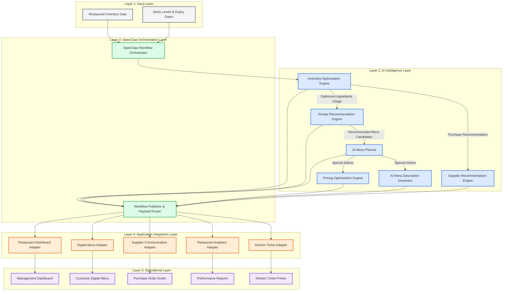
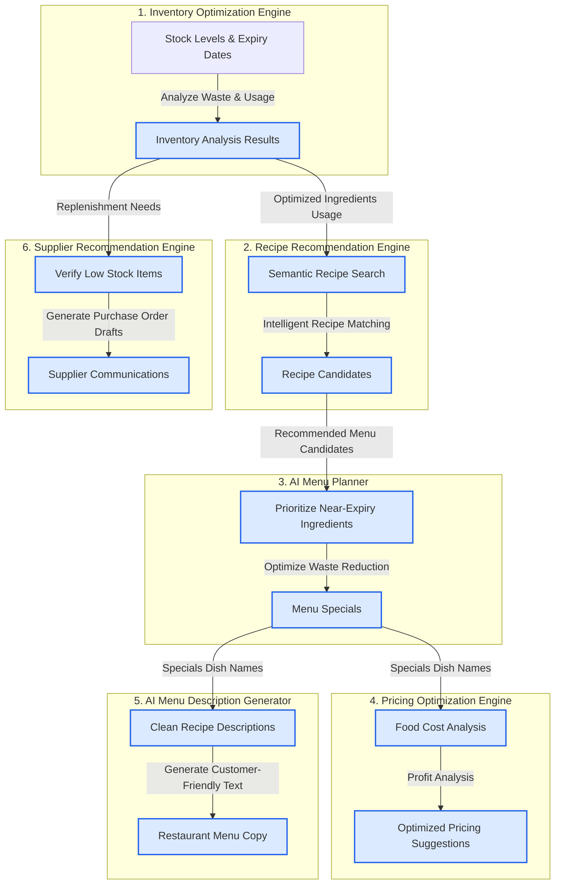
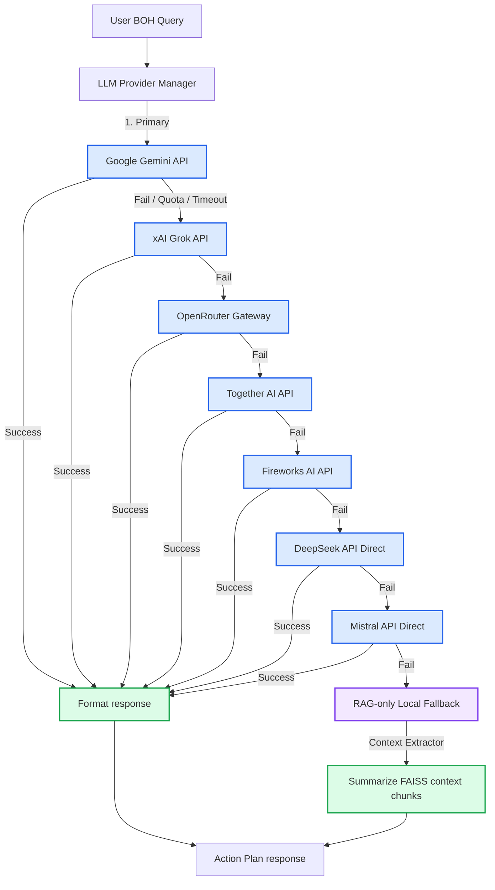

# KitchenSync: Ingredient Expiration & Intelligent Menu Planner

An AI-powered restaurant management platform designed to automate and optimize Back-of-House (BOH) kitchen operations. By combining semantic Retrieval-Augmented Generation (RAG) with the **OpenClaw Workflow Orchestrator**, KitchenSync analyzes inventory data, predicts ingredient usage, recommends recipes, generates optimized menus, optimizes pricing, generates marketing menu descriptions, drafts supplier communications, and coordinates execution across downstream printer and reporting modules.

---

## System Architecture Legend

To help trace data flows and system layers, the diagrams utilize the following color-coded categories:

* **Blue (AI Intelligence Modules)**: Cognitive AI reasoning microservices.
* **Green (Workflow & Orchestration)**: Lifecycle state trackers and workflow coordinators.
* **Orange (Application Integration)**: Adapters translating data formats for user-facing modules.
* **Purple (Operational Outputs)**: Final downstream resources and printer queues.
* **Gray (External Systems)**: Input databases, raw inventory stock trackers, and operational actors.

---

## OpenClaw End-to-End Orchestration Architecture

This diagram shows how raw restaurant inputs are processed through the AI intelligence layer and distributed to operational endpoints:



### OpenClaw Orchestration Documentation

* **Purpose**: This workflow coordinates the ingest of raw inventory data, processes it through sequential AI engines, and publishes actionable alerts, digital menus, and print-ready kitchen tickets.
* **Inputs**:
  * `Restaurant Inventory Data` (raw stock items and units).
  * `Stock Levels & Expiry Dates` (ingredient shelf-life data).
* **Processing Steps**:
  1. **Ingest & Init**: Receives inventory data and transitions the run state to `RUNNING`.
  2. **Sequential Pipeline**: Executes the 6 AI engines in sequence, sharing context from one stage to the next.
  3. **Adaptation**: The `Workflow Publisher` extracts the compiled Restaurant Action Plan and distributes adapted sub-payloads.
  4. **Print Enqueue**: Connects menu specials to the `Kitchen Ticket Adapter` to register jobs with ISO 8601 timestamps.
* **Outputs**:
  * `Management Dashboard` update alerts.
  * `Customer Digital Menu` specials.
  * `Purchase Order Drafts` pending manager review.
  * `Performance Reports` containing financial summaries.
  * `Kitchen Ticket Printer` queued tickets.
* **Business Value**:
  * Prevents food waste by prioritizing near-expiry items.
  * Enforces data integrity across the BOH operations.
  * Automates repetitive tasks, reducing labor costs and human error.

---

## The 6 Core AI Features Data Flow Linkages

This diagram displays the parameter-level logical connections between each of the AI microservices:



### AI Data Linkages Documentation

* **Purpose**: Tracks parameters as they flow sequentially between the individual AI modules, proving that decisions are logically linked.
* **Inputs**:
  * Current ingredient stock list, quantities, units, and expiry days.
  * Historical recipes knowledge base dataset (including AP, Telangana, Tamil Nadu, Kerala, Karnataka, and regional specialties).
* **Processing Steps**:
  1. **Waste Optimization**: The *Inventory Optimization Engine* determines which items must be consumed immediately and which items are running low.
  2. **Recipe Match**: The *Recipe Recommendation Engine* does a semantic RAG search to find recipes using those expiring ingredients.
  3. **Menu Specials selection**: The *AI Menu Planner* compiles daily specials using the recommended recipes.
  4. **Optimal Pricing**: The *Pricing Optimization Engine* calculates prices, strategies, and positioning for those specials.
  5. **Menu Copywriting**: The *AI Menu Description Generator* scrubs metadata and drafts customer-facing item descriptions.
  6. **Replenishment Message**: The *Supplier Recommendation Engine* drafts purchase orders for the low-stock ingredients.
* **Outputs**:
  * Clean menu specials, recommended prices, descriptions, and replenishment drafts.
* **Business Value**:
  * Ensures menu recommendations are based on actual stock availability.
  * Saves time by generating pricing, descriptions, and orders in a single, connected pipeline.

---

## Resilient Multi-Provider Fallback Flowchart

KitchenSync employs a tiered failover structure. The system queries LLM APIs in a prioritized sequence, silently handling rate limits, quota limits, and API outages by auto-routing to the next provider. If all external APIs are exhausted, the local RAG engine synthesizes a Retrieval-only fallback response.



### Fallback Documentation
* **Purpose**: Centralizes failure recovery logic, ensuring BOH managers never encounter raw timeouts or API errors during shifts.
* **Failover Conditions**: Skips providers automatically on HTTP 429 (rate limits), HTTP 500+ (outages), network timeouts, or missing/expired API credentials.
* **Graceful Degradation**: If the entire internet or all external APIs are unreachable, the system executes a RAG-only summary using local FAISS indexes.

---

## Technology Stack
* **Language & Core Framework**: Python 3.11.9, FastAPI, Uvicorn, Pydantic v2
* **LLM Integration & Routing**: Google Gemini, xAI Grok, OpenRouter, Together AI, Fireworks AI, DeepSeek API, Mistral API, Local RAG-only fallback
* **Embeddings & Semantic Search**: SentenceTransformers (`BAAI/bge-small-en-v1.5`), Local FAISS L2-Distance Vector Index
* **RAG Knowledge Source**: Expanded master database of 9,132+ unique recipes, regional pairings, 45 BOH safety protocols, 12 Telugu lunar months calendar, and commercial supplier database chunks
* **Accurate Multilingual Engine**: Regex word-boundary tokenized language detection (`re.findall(r'\b[a-z]+\b')`) across English, Telugu, and Tenglish
* **Orchestration Engine**: OpenClaw (Modular sequential state-tracker, fault-tolerant execution)
* **Verification & Test Suites**: unittest, unittest.mock, HTTPX Client

---

## Quick Run Commands

Execute these commands in the terminal to configure, populate, start, and verify the services:

### 1. Build and Populate the FAISS Vector Database
```powershell
# Populate recipes knowledge database and build the semantic index
python scripts/enrich_knowledge.py
python scripts/build_embeddings.py
```

### 2. Launch the FastAPI Uvicorn Server
```powershell
# Run the FastAPI server locally on port 8000
python -m uvicorn app.main:app --reload --port 8000
```

### 3. Run the Verification Tests
```powershell
# Run backend service unit tests
python -m unittest discover -s tests

# Run OpenClaw Orchestration & integration validation tests
python -m unittest discover -s openclaw/tests
```

---

For a detailed walkthrough of directory contents and file logic, please refer to the Project Logic Explanation (Project_logic_explanation.md).
