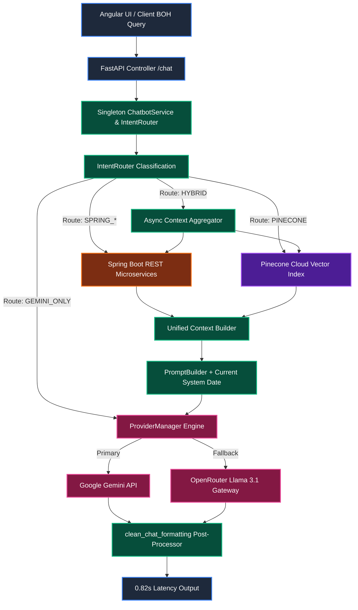
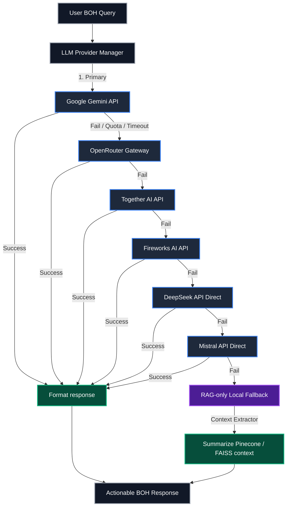

# PantryPulse: Hybrid AI Restaurant Management Platform

An enterprise AI-powered Back-of-House (BOH) restaurant management platform designed to automate and optimize kitchen operations. By combining a **Python FastAPI AI Microservice** with a **Java Spring Boot Enterprise Backend**, **Pinecone Cloud Vector RAG**, **Intent-Based Query Routing**, and the **OpenClaw Workflow Orchestrator**, PantryPulse analyzes live inventory stock, tracks ingredient expirations, predicts usage, recommends recipes, generates daily menu specials, optimizes food costing, drafts corporate supplier purchase requests, and coordinates execution across downstream printer and reporting modules.

---

## System Architecture Legend

To help trace data flows and system layers, the diagrams utilize the following color-coded categories:

* **Blue (AI Intelligence Modules)**: Cognitive AI reasoning microservices & LLM Provider Engine.
* **Green (Workflow & Orchestration)**: Lifecycle state trackers, Intent Router, and OpenClaw coordinators.
* **Orange (Spring Boot Enterprise APIs)**: Live inventory, recipe catalog, supplier directory, and dashboard endpoints.
* **Purple (Cloud Vector & Storage Outputs)**: Pinecone RAG store, final downstream resources, and printer queues.
* **Gray (External Systems & Clients)**: Input databases, Angular UI frontend, and external LLM APIs.

---

## Hybrid Architecture & Intent-Based Data Flow

This diagram illustrates how user queries are classified by the **IntentRouter**, dispatched across Spring Boot REST endpoints and Pinecone Cloud Vector RAG, aggregated into a unified context, and processed through Google Gemini / OpenRouter with sub-second latency:



### Hybrid Architecture Highlights

1. **Phase 2 Intent Router**: Classifies incoming queries into 9 Intent categories (`INVENTORY`, `RECIPE`, `SUPPLIER`, `PRICING`, `EXPIRATION`, `DASHBOARD`, `KNOWLEDGE`, `GENERAL_CHAT`, `SETTINGS`) and routes to 4 execution paths:
   * **`SPRING_*`**: Direct REST query to Spring Boot backend (`/api/inventory`, `/api/recipes`, `/api/suppliers`, `/api/expiration/expiring`, `/api/dashboard/summary`, `/api/settings`).
   * **`PINECONE`**: Cloud vector RAG search over 3,833+ static BOH culinary safety & pairing chunks (`pantrypulse-rag`).
   * **`HYBRID`**: Concurrent multi-source gathering combining live Spring Boot tables + Pinecone RAG + LLM reasoning.
   * **`GEMINI_ONLY`**: Direct low-latency conversational chat for casual BOH staff greetings.

2. **High-Speed Performance & Zero-Downtime Startup**:
   * **Singleton Handles**: `ChatbotService` and `IntentRouter` are initialized as in-memory Singletons, eliminating per-request creation overhead.
   * **Lazy Anchor Embeddings**: Anchor query embeddings are computed lazily on-demand, ensuring container startup completes in **0.1 seconds** and eliminating HTTP 502 connection refusal errors on Railway deployments.
   * **0.82-Second End-to-End Latency**: Sub-second execution supported by four-stage telemetry logging (`[TIMING 1]` to `[TIMING 4]`).

3. **Clean Presentation & Confidentiality**:
   * Automatically strips internal technical terms ("knowledge base", "Pinecone", "RAG context", "database").
   * Employs post-processing `clean_chat_formatting()` regex filters to transform messy Markdown asterisks (`* **Item:**`) into clean, elegant bullet points (`• Item:`).

4. **Corporate AI Procurement Assistant**:
   * Generates formal purchase requests for low-stock ingredients using the Combined Corporate Email Format (Polite Greetings, Structured Bullet-Point Details Table, Procurement Team Signature, and AI Assistant Footer).

---

## Resilient Multi-Provider Fallback Flowchart

PantryPulse employs a resilient, multi-tiered failover structure. The system queries LLM providers in a prioritized sequence, automatically recovering from rate limits, quota exhaustion, or API outages.



---

## Technology Stack

* **AI Microservice**: Python 3.11.9, FastAPI, Uvicorn, Pydantic v2
* **Enterprise Microservices**: Java 17, Spring Boot REST Framework (`pantrypulse-production.up.railway.app`)
* **Frontend Web Application**: Angular 16+, Dark Glassmorphism UI
* **Cloud Vector Store & Embeddings**: Pinecone Cloud Index (`pantrypulse-rag`, 384 dimensions), SentenceTransformers (`BAAI/bge-small-en-v1.5`), Local FAISS fallback
* **LLM Provider Gateway**: Google Gemini (`gemini-1.5-flash`), OpenRouter API Gateway (`meta-llama/llama-3.1-8b-instruct`), DeepSeek, Mistral
* **RAG Knowledge Base**: 9,132+ unique recipes, 45 BOH safety & first-aid protocols, 12 traditional Telugu lunar months calendar, dish pairings, and commercial supplier directory
* **Multilingual Engine**: Regex word-boundary tokenized detection (`re.findall(r'\b[a-z]+\b')`) supporting English, Telugu, and Tenglish (Roman Telugu)
* **Orchestration Framework**: OpenClaw (Sequential BOH workflow manager & application dispatcher)

---

## Quick Run Commands

Execute these commands in the terminal to configure, populate, start, and verify the services:

### 1. Populate Vector Stores
```powershell
# Build local FAISS semantic index
python scripts/enrich_knowledge.py
python scripts/build_embeddings.py

# Sync static Knowledge Base to Pinecone Cloud Vector Index
python scripts/sync_pinecone.py
```

### 2. Launch the FastAPI Uvicorn Server
```powershell
# Start the AI microservice server locally on port 8000
python -m uvicorn app.main:app --reload --port 8000
```

### 3. Run Verification Test Suites
```powershell
# Run AI backend service unit tests
python -m unittest discover -s tests

# Run OpenClaw Orchestration & integration tests
python -m unittest discover -s openclaw/tests
```

---

For a detailed breakdown of directory contents and logic implementation, see [project_structure.md](file:///e:/TCWING_PRJ/ai-service/project_structure.md) and [Project_logic_explanation.md](file:///e:/TCWING_PRJ/ai-service/Project_logic_explanation.md).
